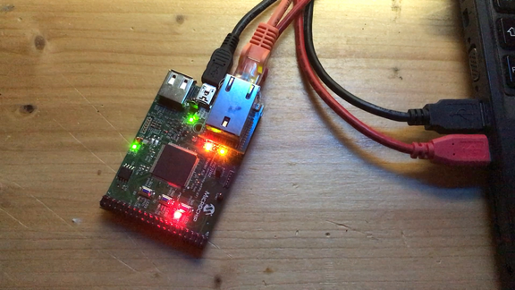
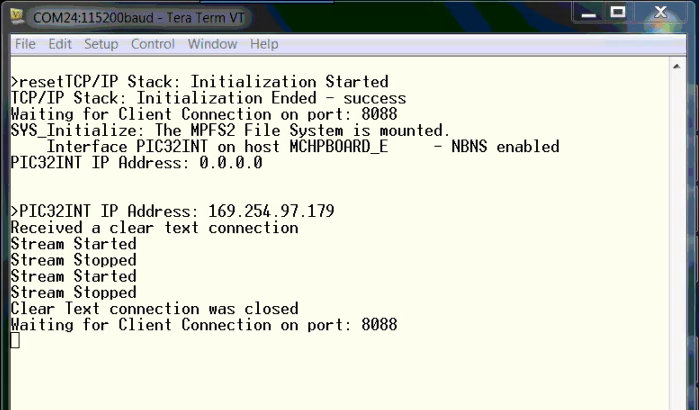
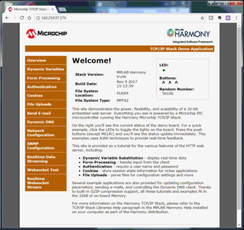
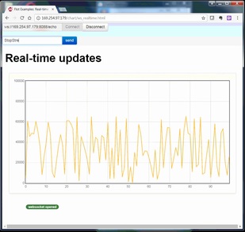
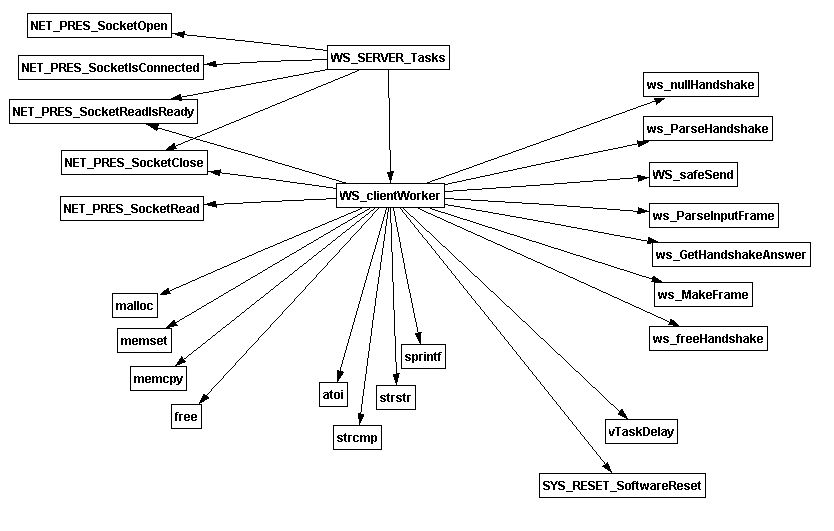

A video says more like a thousand pictures http://vimeo.com/242098558

This is the basis of any interactive Webinterface controlling embedded systems asynchronously in real-time with no server in between.

The demo setup is a Standard PIC32MZ Embedded Connectivity with FPU (EF) Starter Kit: Part Number: DM320007

Datasheet: http://ww1.microchip.com/downloads/en/DeviceDoc/70005230B.pdf

Order at: https://octopart.com/search?q=%20DM320007&start=0

A USB cable Mini B for programming and power supply and a RJ45, which is switched from the PIC board directly to the PC. No switch or network necessary. (If necessary, another mini B for UART debug issues (is chic, but also goes without))

You can see the standard website from the Harmony TCPIP Stack. So you can see how an embedded webserver looks like.
Extended with a so-called Websocket. This can be used to create an asynchronous connection between a Javascript based web interface and the embedded client. 

It is shown how a data stream generated in the PIC (at first only a noise) and is transmitted to the browser and displayed there graphically (Flot with JQuery). Pressing the switch on the board turns the noise into a ramp.

An online oscilloscope, so to speak.

Simple setup with a standard tool. Would have to work everywhere.

The IP address is the AutoIP address 169.254.97.179 with the network mask 255.255.0.0

Also, the NetBIOS name http://MCHPBOARD_E would have to work in the browser immediately.

This would have a Windows computer can connect directly immediately if no DHCP is involved.
If the board is plugged into a network with DHCP then the PIC fetches an address from the DHCP. Then also works http://MCHPBOARD_E

Here the Callgraph of the Websocket Task

Memory Footprint for the Websocket Functions:

| Address | Size    | Access    |Function  |
|---------|---------|-----------|----------|
| 9d093180|  1544   |GLOBAL     |WS_clientWorker
| 9d095e98|  1280   |GLOBAL     |ws_ParseHandshake
| 9d09d2fc|   832   |GLOBAL     |ws_sha1mix
| 9d0a4e98|   560   |GLOBAL     |ws_GetHandshakeAnswer
| 9d0a6da0|   508   |LOCAL      |ws_sha1
| 9d0adc34|   372   |GLOBAL     |WS_SERVER_Tasks
| 9d0ae7b4|   360   |GLOBAL     |ws_ParseInputFrame
| 9d0b05b8|   340   |GLOBAL     |ws_MakeFrame
| 9d0b455c|   284   |LOCAL      |ws_base64
| 9d0bba3c|   200   |GLOBAL     |WS_safeSend
| 9d0bd790|   180   |LOCAL      |ws_getUptoLinefeed
| 9d0c1680|   144   |GLOBAL     |WS_SendDataCallback
| 9d0c39dc|   120   |GLOBAL     |ws_freeHandshake
| 9d0cc59c|    32   |LOCAL      |_WS_SERVER_Tasks
| 9d0cc5fc|    32   |GLOBAL     |WS_SERVER_Initialize
| 9d0ccc28|    28   |GLOBAL     |ws_nullHandshake
 
Summ: 6816 Bytes

| Address | Size    | Access    |Variable  |
|---------|---------|-----------|----------|  
| 8000003c|     3   |LOCAL      | ws_rn                         
| 8000035c|     2   |GLOBAL     | WS_ActiveclientSocket         
| 800003dc|    12   |GLOBAL     | ws_serverData                 
| 80002954|    64   |GLOBAL     | ws_w                          
| 80002994| 65535   |GLOBAL     | WS_gBuffer                    
| 80033234|    25   |GLOBAL     | ws_ServerKey                  
| 80033250|    20   |GLOBAL     | ws_r                          
                                                                                 
Summ: 65661 Bytes

The 64k of WS_gBuffer can be dramatically reduced. This number is way to high for normal operation. 
This Buffer is the Incomong and Outgoing Buffer for the Websocket.
